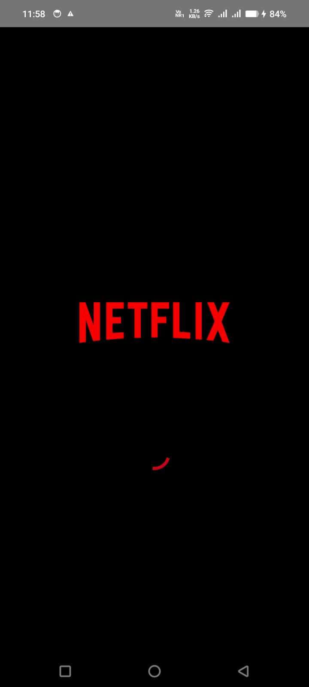
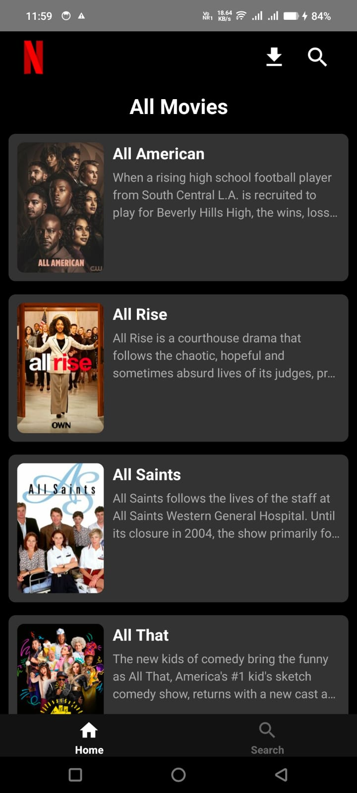
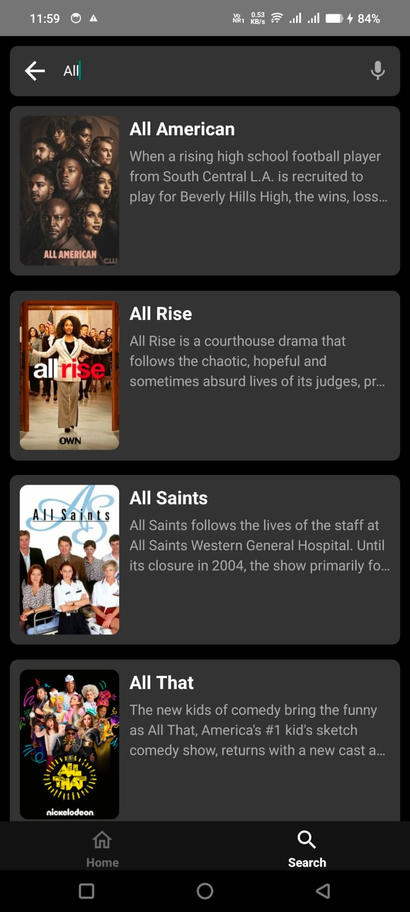
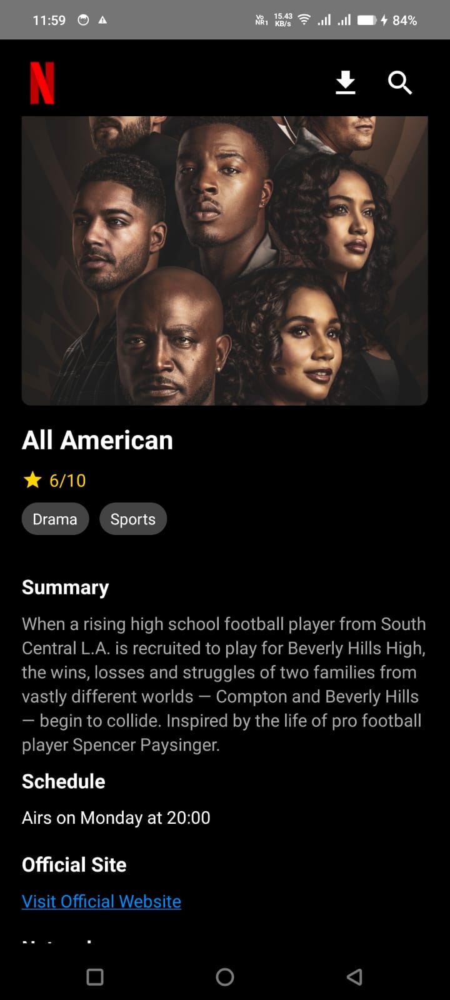

# React Native Movie App

This React Native application is a movie browsing app inspired by Netflix's UI. It includes the following features:

- Splash Screen
- Home Screen
- Search Screen
- Details Screen

## Features

### Splash Screen
- Displays a Netflix Animation.

### Home Screen
- Fetches and displays a list of movies using the API endpoint: `https://api.tvmaze.com/search/shows?q=all`.
- Each movie includes:
  - Thumbnail image
  - Title
  - Summary
- Clicking on any movie redirects to the **Details Screen**.
- A search bar at the top redirects to the **Search Screen** when clicked.

### Search Screen
- Includes a search bar to search for movies.
- Fetches and displays search results using the API endpoint: `https://api.tvmaze.com/search/shows?q=${search_term}`.
- Displays search results in the same format as the **Home Screen**.

### Details Screen
- Displays detailed information about a selected movie:
  - Image
  - Title
  - Summary
  - Other available details from the API response.

### Navigation
- Includes a bottom navigation bar to switch between the **Home Screen** and the **Search Screen**.

## Technologies Used
- React Native CLI
- JavaScript
- Axios (for API requests)

## How to Run the App

1. **Clone the repository**
   ```bash
   git clone https://github.com/shivrajkadam19/quadb_task_1.git
   cd quadb_task_1
   ```

2. **Install dependencies**
   ```bash
   npm install
   ```

3. **Run the app**
   - For Android:
     ```bash
     cd ./gradlew clean
     cd ..
     npm start --clear-cache
     ```

## Folder Structure
- **assets/**: Contains the splash screen image and other static assets.
- **components/**: Reusable components for the app.
- **screens/**: Contains all the screen components (Splash, Home, Search, Details).
- **navigation/**: Manages bottom navigation and screen transitions.

## APIs Used
- Fetch all movies: `https://api.tvmaze.com/search/shows?q=all`
- Search movies: `https://api.tvmaze.com/search/shows?q=${search_term}`

## Screenshots

<div style="display: flex; flex-direction: row; justify-content: space-around;">
  
  
  
  
</div>

## Demo Video

<div style="display: flex; flex-direction: row; justify-content: space-around;">
  
</div>

## demo App Link

[Download the .apk file](https://drive.google.com/file/d/1it1Wpt6uniRRzOvLrJpQRSHMXpobrT-6/view?usp=sharing)

## Video Demo


Click the image above to watch the video demo.

[Watch the Video Demo](https://drive.google.com/file/d/1R-PXOPxmNopVCW6iJey-zhgsibVq3lxA/view?usp=sharing)

